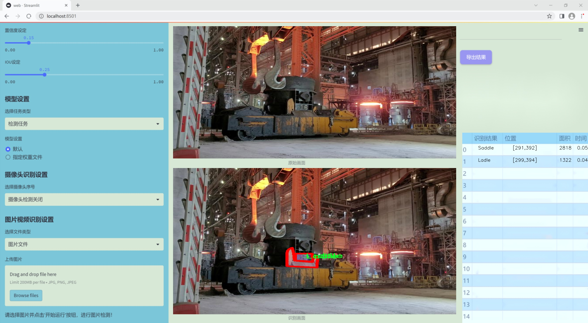
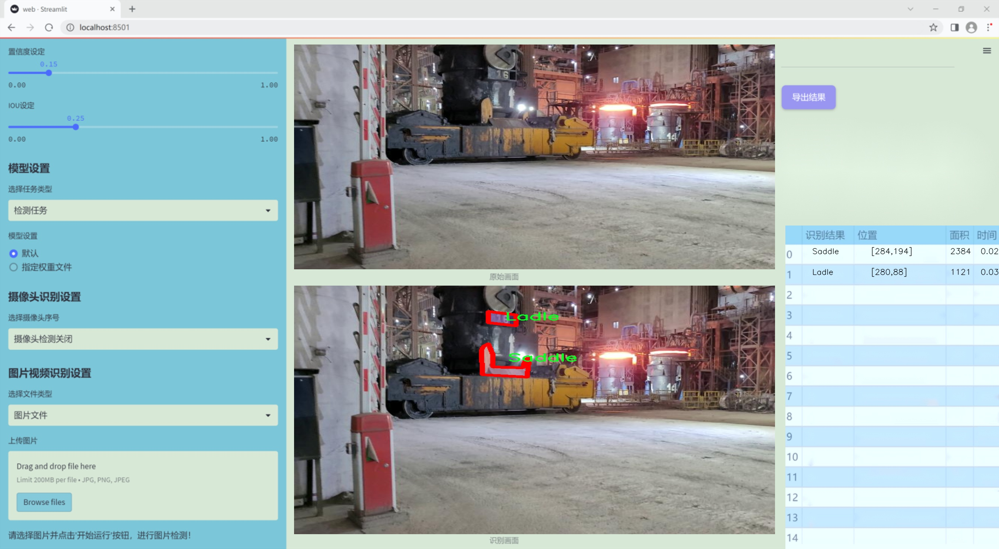
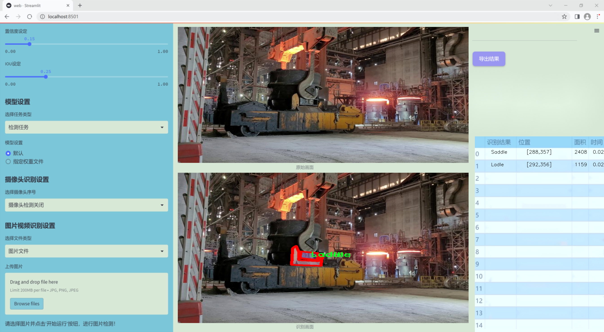
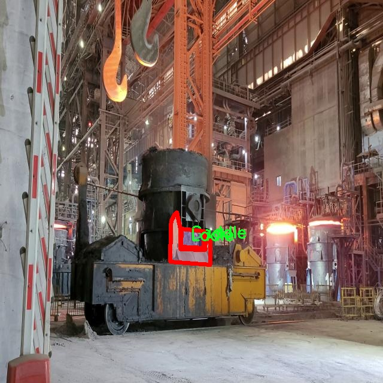
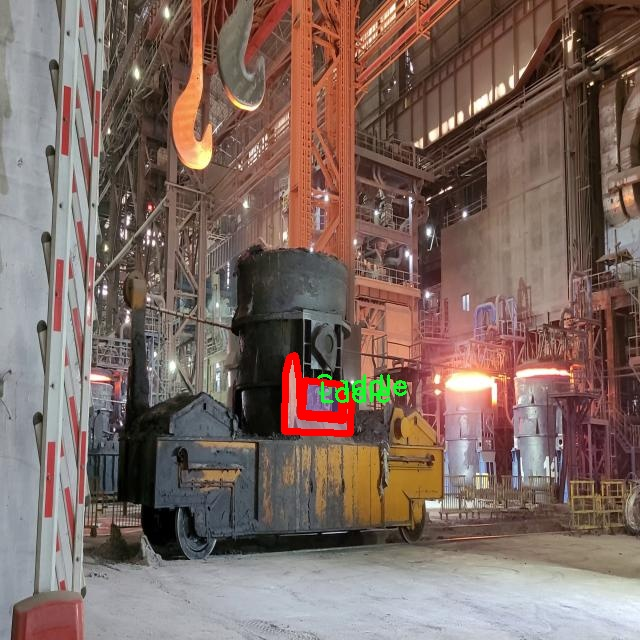
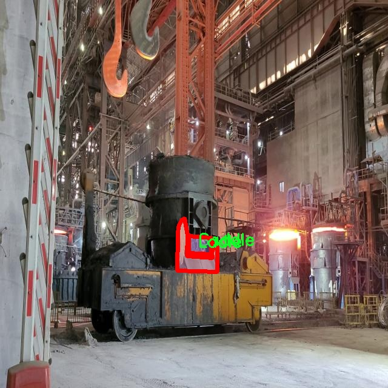

### 1.背景意义

研究背景与意义

在现代工业生产中，钢铁行业作为基础材料的主要供应者，其生产效率和产品质量直接影响到国民经济的各个领域。钢包作为钢铁冶炼过程中的重要设备，其使用状态和位置的准确识别对生产流程的优化至关重要。传统的钢包垫识别方法多依赖人工观察和经验判断，效率低下且容易受到人为因素的影响。因此，开发一种高效、自动化的钢包垫识别系统显得尤为重要。

近年来，计算机视觉技术的迅猛发展为工业自动化提供了新的解决方案。特别是基于深度学习的目标检测与图像分割技术，已经在多个领域取得了显著的成果。YOLO（You Only Look Once）系列模型因其高效的实时检测能力而受到广泛关注。随着YOLOv11的推出，其在精度和速度上的进一步提升，为钢包垫的自动识别提供了更为强大的技术支持。

本研究旨在基于改进的YOLOv11模型，构建一个钢铁厂钢包垫的识别图像分割系统。通过对包含626张图像的数据集进行训练，该系统能够有效识别和分割钢包与垫子这两类关键对象。数据集的构建经过精心设计，确保了标注的准确性和数据的多样性，为模型的训练提供了坚实的基础。该系统的实现不仅可以提高钢铁生产的自动化水平，还能降低人工成本，提升生产安全性。

综上所述，基于改进YOLOv11的钢包垫识别图像分割系统的研究，不仅具有重要的理论意义，还能为钢铁行业的智能化转型提供实用的技术支持，推动整个行业的可持续发展。

### 2.视频效果

[2.1 视频效果](https://www.bilibili.com/video/BV1tJUVY7EyM/)

### 3.图片效果







##### [项目涉及的源码数据来源链接](https://kdocs.cn/l/cszuIiCKVNis)**

注意：本项目提供训练的数据集和训练教程,由于版本持续更新,暂不提供权重文件（best.pt）,请按照6.训练教程进行训练后实现上图演示的效果。

### 4.数据集信息

##### 4.1 本项目数据集类别数＆类别名

nc: 2
names: ['Ladle', 'Saddle']


该项目为【图像分割】数据集，请在【训练教程和Web端加载模型教程（第三步）】这一步的时候按照【图像分割】部分的教程来训练

##### 4.2 本项目数据集信息介绍

本项目数据集信息介绍

本项目旨在改进YOLOv11模型，以实现对钢铁厂钢包垫的高效识别与图像分割。为此，我们构建了一个专门的数据集，命名为“Techex_final”，该数据集包含了与钢铁生产过程密切相关的图像数据，主要聚焦于两个类别：钢包（Ladle）和钢包垫（Saddle）。数据集的设计考虑到了钢铁厂的实际操作环境，确保所收集的图像能够真实反映钢铁生产中的各种场景和条件。

在数据集的构建过程中，我们采集了大量的钢铁厂现场图像，这些图像涵盖了不同的光照条件、视角和背景，以增强模型的鲁棒性和适应性。每个类别的图像均经过精心标注，确保训练数据的准确性和有效性。通过这种方式，我们力求为YOLOv11模型提供丰富且多样化的训练样本，使其能够在实际应用中更好地识别和分割钢包及钢包垫。

数据集的类别数量为2，分别为“Ladle”和“Saddle”。在训练过程中，模型将学习如何区分这两种类别，并在图像中准确定位它们的位置。这不仅有助于提高钢铁生产的自动化水平，还能在一定程度上降低人工操作的风险，提高生产效率。

总之，“Techex_final”数据集的构建为本项目提供了坚实的基础，使得改进后的YOLOv11模型能够在钢铁厂的实际应用中发挥重要作用，推动智能制造的发展。通过对钢包和钢包垫的精准识别与分割，我们期待能够为钢铁行业的智能化转型贡献一份力量。









### 5.全套项目环境部署视频教程（零基础手把手教学）

[5.1 所需软件PyCharm和Anaconda安装教程（第一步）](https://www.bilibili.com/video/BV1BoC1YCEKi/?spm_id_from=333.999.0.0&vd_source=bc9aec86d164b67a7004b996143742dc)


[5.2 安装Python虚拟环境创建和依赖库安装视频教程（第二步）](https://www.bilibili.com/video/BV1ZoC1YCEBw?spm_id_from=333.788.videopod.sections&vd_source=bc9aec86d164b67a7004b996143742dc)

### 6.改进YOLOv11训练教程和Web_UI前端加载模型教程（零基础手把手教学）

[6.1 改进YOLOv11训练教程和Web_UI前端加载模型教程（第三步）](https://www.bilibili.com/video/BV1BoC1YCEhR?spm_id_from=333.788.videopod.sections&vd_source=bc9aec86d164b67a7004b996143742dc)


按照上面的训练视频教程链接加载项目提供的数据集，运行train.py即可开始训练



     Epoch   gpu_mem       box       obj       cls    labels  img_size
     1/200     20.8G   0.01576   0.01955  0.007536        22      1280: 100%|██████████| 849/849 [14:42<00:00,  1.04s/it]
               Class     Images     Labels          P          R     mAP@.5 mAP@.5:.95: 100%|██████████| 213/213 [01:14<00:00,  2.87it/s]
                 all       3395      17314      0.994      0.957      0.0957      0.0843

     Epoch   gpu_mem       box       obj       cls    labels  img_size
     2/200     20.8G   0.01578   0.01923  0.007006        22      1280: 100%|██████████| 849/849 [14:44<00:00,  1.04s/it]
               Class     Images     Labels          P          R     mAP@.5 mAP@.5:.95: 100%|██████████| 213/213 [01:12<00:00,  2.95it/s]
                 all       3395      17314      0.996      0.956      0.0957      0.0845

     Epoch   gpu_mem       box       obj       cls    labels  img_size
     3/200     20.8G   0.01561    0.0191  0.006895        27      1280: 100%|██████████| 849/849 [10:56<00:00,  1.29it/s]
               Class     Images     Labels          P          R     mAP@.5 mAP@.5:.95: 100%|███████   | 187/213 [00:52<00:00,  4.04it/s]
                 all       3395      17314      0.996      0.957      0.0957      0.0845


###### [项目数据集下载链接](https://kdocs.cn/l/cszuIiCKVNis)

### 7.原始YOLOv11算法讲解

YOLOv11是一种由Ultralytics公司开发的最新一代目标检测模型，以其增强的特征提取能力和更高的效率在计算机视觉领域引人注目。该模型在架构上进行了关键升级，通过更新主干和颈部结构，显著提高了对复杂视觉场景的理解和处理精度。YOLOv11不仅在目标检测上表现出色，还支持实例分割、图像分类、姿态估计和定向目标检测（OBB）等任务，展示出其多功能性。

与其前身YOLOv8相比，YOLOv11在设计上实现了深度和宽度的改变，同时引入了几个创新机制。其中，C3k2机制是对YOLOv8中的C2f的改进，提升了浅层特征的处理能力；C2PSA机制则进一步优化了特征图的处理流程。解耦头的创新设计，通过增加两个深度卷积（DWConv），提高了模型对细节的感知能力和分类准确性。

在性能上，YOLOv11m模型在COCO数据集上的平均精度（mAP）提高，并减少了22%的参数量，确保了在运算效率上的突破。该模型可以部署在多种平台上，包括边缘设备、云平台以及支持NVIDIA GPU的系统，彰显出卓越的灵活性和适应性。总体而言，YOLOv11通过一系列的创新突破，对目标检测领域产生了深远的影响，并为未来的开发提供了新的研究方向。


****文档**** ： _ _https://docs.ultralytics.com/models/yolo11/__

****代码链接**** ： _ _https://github.com/ultralytics/ultralytics__

******Performance Metrics******


​ ** **关键特性****

****◆**** ** **增强的特征提取能力**** ：YOLO11采用了改进的主干和颈部架构，增强了 ** **特征提取****
能力，能够实现更精确的目标检测和复杂任务的执行。

****◆**** ** **优化的效率和速度****
：YOLO11引入了精细化的架构设计和优化的训练流程，提供更快的处理速度，并在准确性和性能之间保持最佳平衡。

****◆**** ** **参数更少、精度更高****
：通过模型设计的改进，YOLO11m在COCO数据集上实现了更高的平均精度（mAP），同时使用的参数比YOLOv8m少22%，使其在计算上更加高效，而不牺牲准确性。

****◆**** ** **跨环境的适应性**** ：YOLO11可以无缝部署在各种环境中，包括边缘设备、云平台和支持NVIDIA
GPU的系统，确保最大的灵活性。

****◆**** ** **支持广泛任务****
：无论是目标检测、实例分割、图像分类、姿态估计还是定向目标检测（OBB），YOLO11都旨在应对一系列计算机视觉挑战。

****支持的任务和模式****


​YOLO11建立在YOLOv8中引入的多功能模型范围之上，为各种计算机视觉任务提供增强的支持:


​该表提供了YOLO11模型变体的概述，展示了它们在特定任务中的适用性以及与Inference、Validation、Training和Export等操作模式的兼容性。从实时检测到复杂的分割任务
，这种灵活性使YOLO11适用于计算机视觉的广泛应用。

##### yolov11的创新

■ yolov8 VS yolov11

YOLOv5，YOLOv8和YOLOv11均是ultralytics公司的作品，ultralytics出品必属精品。


​ **具体创新点** ：

**① 深度（depth）和宽度 （width）**

YOLOv8和YOLOv11是基本上完全不同。

**② C3k2机制**

C3k2有参数为c3k，其中在网络的浅层c3k设置为False。C3k2就相当于YOLOv8中的C2f。


​ **③ C2PSA机制**

下图为C2PSA机制的原理图。


​ **④ 解耦头**

解耦头中的分类检测头增加了两个 **DWConv** 。


▲Conv

    
    
    def autopad(k, p=None, d=1):  # kernel, padding, dilation
    
        """Pad to 'same' shape outputs."""
    
        if d > 1:
    
            k = d * (k - 1) + 1 if isinstance(k, int) else [d * (x - 1) + 1 for x in k]  # actual kernel-size
    
        if p is None:
    
            p = k // 2 if isinstance(k, int) else [x // 2 for x in k]  # auto-pad
    
    return p
    
    
    class Conv(nn.Module):
    
        """Standard convolution with args(ch_in, ch_out, kernel, stride, padding, groups, dilation, activation)."""
    
    
        default_act = nn.SiLU()  # default activation
    
    
        def __init__(self, c1, c2, k=1, s=1, p=None, g=1, d=1, act=True):
    
            """Initialize Conv layer with given arguments including activation."""
    
            super().__init__()
    
            self.conv = nn.Conv2d(c1, c2, k, s, autopad(k, p, d), groups=g, dilation=d, bias=False)
    
            self.bn = nn.BatchNorm2d(c2)
    
            self.act = self.default_act if act is True else act if isinstance(act, nn.Module) else nn.Identity()
    
    
        def forward(self, x):
    
            """Apply convolution, batch normalization and activation to input tensor."""
    
            return self.act(self.bn(self.conv(x)))
    
    
        def forward_fuse(self, x):
    
            """Perform transposed convolution of 2D data."""
    
            return self.act(self.conv(x))

▲Conv2d

    
    
    torch.nn.Conv2d(in_channels, out_channels, kernel_size, stride=1, padding=0, dilation=1, groups=1, bias=True, padding_mode='zeros')

▲DWConv

DWConv ** **代表 Depthwise Convolution（深度卷积）****
，是一种在卷积神经网络中常用的高效卷积操作。它主要用于减少计算复杂度和参数量。

    
    
    class DWConv(Conv):
    
        """Depth-wise convolution."""
    
    
        def __init__(self, c1, c2, k=1, s=1, d=1, act=True):  # ch_in, ch_out, kernel, stride, dilation, activation
    
            """Initialize Depth-wise convolution with given parameters."""
    
            super().__init__(c1, c2, k, s, g=math.gcd(c1, c2), d=d, act=act)


### 8.200+种全套改进YOLOV11创新点原理讲解

#### 8.1 200+种全套改进YOLOV11创新点原理讲解大全

由于篇幅限制，每个创新点的具体原理讲解就不全部展开，具体见下列网址中的改进模块对应项目的技术原理博客网址【Blog】（创新点均为模块化搭建，原理适配YOLOv5~YOLOv11等各种版本）

[改进模块技术原理博客【Blog】网址链接](https://gitee.com/qunmasj/good)


#### 8.2 精选部分改进YOLOV11创新点原理讲解

###### 这里节选部分改进创新点展开原理讲解(完整的改进原理见上图和[改进模块技术原理博客链接](https://gitee.com/qunmasj/good)【如果此小节的图加载失败可以通过CSDN或者Github搜索该博客的标题访问原始博客，原始博客图片显示正常】


### 感受野注意力卷积（RFAConv)
#### 标准卷积操作回顾
标准的卷积操作是构造卷积神经网络的基本构件。它利用具有共享参数的滑动窗口提取特征信息，克服了全连通层构造神经网络固有的参数多、计算开销大的问题。设 X R∈C×H×W
表示输入特征图，其中C、H、W分别表示特征图的通道数、高度、宽度。为了清楚地演示卷积核的特征提取过程，我们使用 C = 1 的例子。从每个接受域滑块中提取特征信息的卷积运算可以表示为:


这里，Fi 表示计算后每个卷积滑块得到的值，Xi 表示每个滑块内对应位置的像素值，K表示卷积核，S表示卷积核中的参数个数，N表示接收域滑块的总数。可以看出，每个滑块内相同位置的 feature共享相同的参数Ki。因此，标准的卷积运算并不能捕捉到不同位置所带来的信息差异，这最终在一定程度上限制了卷积神经网络的性能。 

#### 空间注意力回顾
目前，空间注意机制是利用学习得到的注意图来突出每个特征的重要性。与前一节类似，这里以 C=1为例。突出关键特征的空间注意机制可以简单表述为:这里，Fi 表示加权运算后得到的值。xi 和Ai 表示输入特征图和学习到的注意图在不同位置的值，N为输入特征图的高和宽的乘积，表示像素值的总数。


#### 空间注意与标准卷积运算
将注意力机制整合到卷积神经网络中，可以提高卷积神经网络的性能。通过对标准卷积运算和现有空间注意机制的研究，我们认为空间注意机制有效地克服了卷积神经网络固有的参数共享的局限性。目前卷积神经网络中最常用的核大小是 1 × 1和3 × 3。在引入空间注意机制后，提取特征的卷积操作可以是 1 × 1或3 × 3卷积操作。为了直观地展示这个过程，在 1 × 1卷积运算的前面插入了空间注意机制。通过注意图对输入特征图(Re-weight“×”)进行加权运算，最后通过 1 × 1卷积运算提取接收域的滑块特征信息。整个过程可以简单地表示如下:


 这里卷积核K仅代表一个参数值。如果取A i× ki 的值作为一种新的卷积核参数，有趣的是它解决了 1×1卷积运算提取特征时的参数共享问题。然而，关于空间注意机制的传说到此结束。当空间注意机制被插入到3×3卷积运算前面时。具体情况如下:


如上所述，如果取A的值 i × ki (4)式作为一种新的卷积核参数，完全解决了大规模卷积核的参数共享问题。然而，最重要的一点是，卷积核在提取每个接受域滑块的特征时，会共享一些特征。换句话说，每个接收域滑块内都有一个重叠。仔细分析后会发现A12= a21， a13 = a22， a15 = a24……，在这种情况下，每个滑动窗口共享空间注意力地图的权重。因此，空间注意机制没有考虑整个接受域的空间特征，不能有效地解决大规模卷积核的参数共享问题。因此，空间注意机制的有效性受到限制。 

#### 创新空间注意力和标准卷积操作
该博客提出解决了现有空间注意机制的局限性，为空间处理提供了一种创新的解决方案。受RFA的启发，一系列空间注意机制被开发出来，可以进一步提高卷积神经网络的性能。RFA可以看作是一个轻量级即插即用模块，RFA设计的卷积运算(RFAConv)可以代替标准卷积来提高卷积神经网络的性能。因此，我们预测空间注意机制与标准卷积运算的结合将继续发展，并在未来带来新的突破。
接受域空间特征:为了更好地理解接受域空间特征的概念，我们将提供相关的定义。接收域空间特征是专门为卷积核设计的，并根据核大小动态生成。如图1所示，以3×3卷积核为例。在图1中，“Spatial Feature”指的是原始的Feature map。“接受域空间特征”是空间特征变换后的特征图。

 

由不重叠的滑动窗口组成。当使用 3×3卷积内核提取特征时，接收域空间特征中的每个 3×3大小窗口代表一个接收域滑块。接受域注意卷积(RFAConv):针对接受域的空间特征，我们提出了接受域注意卷积(RFA)。该方法不仅强调了接收域滑块内不同特征的重要性，而且对接收域空间特征进行了优先排序。通过该方法，完全解决了卷积核参数共享的问题。接受域空间特征是根据卷积核的大小动态生成的，因此，RFA是卷积的固定组合，不能与卷积操作的帮助分离，卷积操作同时依赖于RFA来提高性能，因此我们提出了接受场注意卷积(RFAConv)。具有3×3大小的卷积核的RFAConv整体结构如图所示。


目前，最广泛使用的接受域特征提取方法是缓慢的。经过大量的研究，我们开发了一种快速的方法，用分组卷积来代替原来的方法。具体来说，我们利用相应大小的分组卷积来动态生成基于接受域大小的展开特征。尽管与原始的无参数方法(如PyTorch提供的nn.())相比，该方法增加了一些参数，但它的速度要快得多。注意:如前一节所述，当使用 3×3卷积内核提取特征时，接收域空间特征中的每个 3×3大小窗口表示一个接收域滑块。而利用快速分组卷积提取感受野特征后，将原始特征映射为新的特征。最近的研究表明。交互信息可以提高网络性能，如[40,41,42]所示。同样，对于RFAConv来说，通过交互接受域特征信息来学习注意图可以提高网络性能。然而，与每个接收域特征交互会导致额外的计算开销，因此为了最小化计算开销和参数的数量，我们使用AvgPool来聚合每个接收域特征的全局信息。然后，使用 1×1 组卷积操作进行信息交互。最后，我们使用softmax来强调每个特征在接受域特征中的重要性。一般情况下，RFA的计算可以表示为:


这里gi×i 表示一个大小为 i×i的分组卷积，k表示卷积核的大小，Norm表示归一化，X表示输入的特征图，F由注意图 a相乘得到 rf 与转换后的接受域空间特征 Frf。与CBAM和CA不同，RFA能够为每个接受域特征生成注意图。卷积神经网络的性能受到标准卷积操作的限制，因为卷积操作依赖于共享参数，对位置变化带来的信息差异不敏感。然而，RFAConv通过强调接收域滑块中不同特征的重要性，并对接收域空间特征进行优先级排序，可以完全解决这个问题。通过RFA得到的feature map是接受域空间特征，在“Adjust Shape”后没有重叠。因此，学习到的注意图将每个接受域滑块的特征信息聚合起来。换句话说，注意力地图不再共享在每个接受域滑块。这完全弥补了现有 CA和CBAM注意机制的不足。RFA为标准卷积内核提供了显著的好处。而在调整形状后，特征的高度和宽度是 k倍，需要进行 stride = k的k × k卷积运算来提取特征信息。RFA设计的卷积运算RFAConv为卷积带来了良好的增益，对标准卷积进行了创新。
此外，我们认为现有的空间注意机制应该优先考虑接受域空间特征，以提高网络性能。众所周知，基于自注意机制的网络模型[43,44,45]取得了很大的成功，因为它解决了卷积参数共享的问题，并对远程信息进行建模。然而，自注意机制也为模型引入了显著的计算开销和复杂性。我们认为，将现有的空间注意机制的注意力引导到接受场空间特征上，可以以类似于自我注意的方式解决长期信息的参数共享和建模问题。与自我关注相比，这种方法需要的参数和计算资源少得多。答案如下:(1)将以接收场空间特征为中心的空间注意机制与卷积相结合，消除了卷积参数共享的问题。(2)现有的空间注意机制已经考虑了远程信息，可以通过全局平均池或全局最大池的方式获取全局信息，其中明确考虑了远程信息。因此，我们设计了新的 CBAM和CA模型，称为RFCBAM和RFCA，它们专注于接受域空间特征。与RFA类似，使用最终的k × k stride = k 的卷积运算来提取特征信息。这两种新的卷积方法的具体结构如图 3所示，我们称这两种新的卷积操作为 RFCBAMConv和RFCAConv。与原来的CBAM相比，我们在RFCBAM中使用SE attention来代替CAM。因为这样可以减少计算开销。此外，在RFCBAM中，通道注意和空间注意不是分开执行的。相反，它们是同时加权的，使得每个通道获得的注意力地图是不同的。


### 9.系统功能展示

图9.1.系统支持检测结果表格显示

  图9.2.系统支持置信度和IOU阈值手动调节

  图9.3.系统支持自定义加载权重文件best.pt(需要你通过步骤5中训练获得)

  图9.4.系统支持摄像头实时识别

  图9.5.系统支持图片识别

  图9.6.系统支持视频识别

  图9.7.系统支持识别结果文件自动保存

  图9.8.系统支持Excel导出检测结果数据


### 10. YOLOv11核心改进源码讲解

#### 10.1 test_selective_scan.py

以下是代码的核心部分，并附上详细的中文注释：

```python
import torch
import torch.nn.functional as F

def build_selective_scan_fn(selective_scan_cuda: object = None, mode="mamba_ssm", tag=None):
    """
    构建选择性扫描函数的工厂函数。
    
    参数:
    selective_scan_cuda: 选择性扫描的CUDA实现。
    mode: 选择性扫描的模式。
    tag: 标签，用于标识。
    
    返回:
    selective_scan_fn: 构建的选择性扫描函数。
    """
    
    class SelectiveScanFn(torch.autograd.Function):
        @staticmethod
        def forward(ctx, u, delta, A, B, C, D=None, z=None, delta_bias=None, delta_softplus=False, return_last_state=False, nrows=1, backnrows=-1):
            """
            前向传播函数。
            
            参数:
            ctx: 上下文对象，用于保存信息以供反向传播使用。
            u: 输入张量。
            delta: 变化率张量。
            A, B, C: 权重张量。
            D: 可选的张量。
            z: 可选的张量。
            delta_bias: 可选的偏置。
            delta_softplus: 是否使用softplus激活。
            return_last_state: 是否返回最后状态。
            nrows: 行数。
            backnrows: 反向传播的行数。
            
            返回:
            out: 输出张量。
            last_state: 最后状态（可选）。
            """
            # 确保输入张量是连续的
            if u.stride(-1) != 1:
                u = u.contiguous()
            if delta.stride(-1) != 1:
                delta = delta.contiguous()
            if D is not None:
                D = D.contiguous()
            if B.stride(-1) != 1:
                B = B.contiguous()
            if C.stride(-1) != 1:
                C = C.contiguous()
            if z is not None and z.stride(-1) != 1:
                z = z.contiguous()

            # 处理B和C的维度
            if B.dim() == 3:
                B = rearrange(B, "b dstate l -> b 1 dstate l")
                ctx.squeeze_B = True
            if C.dim() == 3:
                C = rearrange(C, "b dstate l -> b 1 dstate l")
                ctx.squeeze_C = True

            # 检查输入的形状是否符合要求
            assert u.shape[1] % (B.shape[1] * nrows) == 0 
            assert nrows in [1, 2, 3, 4]

            # 选择不同的模式进行前向计算
            if mode == "mamba_ssm":
                out, x, *rest = selective_scan_cuda.fwd(u, delta, A, B, C, D, z, delta_bias, delta_softplus)
            else:
                raise NotImplementedError("未实现的模式")

            # 保存用于反向传播的张量
            ctx.save_for_backward(u, delta, A, B, C, D, delta_bias, x)
            last_state = x[:, :, -1, 1::2]  # 获取最后状态
            return out if not return_last_state else (out, last_state)

        @staticmethod
        def backward(ctx, dout):
            """
            反向传播函数。
            
            参数:
            ctx: 上下文对象，包含前向传播时保存的信息。
            dout: 输出的梯度。
            
            返回:
            梯度的元组。
            """
            u, delta, A, B, C, D, delta_bias, x = ctx.saved_tensors
            
            # 反向传播计算
            du, ddelta, dA, dB, dC, dD, ddelta_bias = selective_scan_cuda.bwd(
                u, delta, A, B, C, D, delta_bias, dout, x
            )

            return (du, ddelta, dA, dB, dC, dD if D is not None else None, ddelta_bias if delta_bias is not None else None)

    def selective_scan_fn(u, delta, A, B, C, D=None, z=None, delta_bias=None, delta_softplus=False, return_last_state=False, nrows=1, backnrows=-1):
        """
        选择性扫描函数的封装。
        
        参数:
        同上，具体参数见前向传播函数。
        
        返回:
        选择性扫描的输出。
        """
        outs = SelectiveScanFn.apply(u, delta, A, B, C, D, z, delta_bias, delta_softplus, return_last_state, nrows, backnrows)
        return outs

    return selective_scan_fn

# 示例使用
selective_scan_fn = build_selective_scan_fn(selective_scan_cuda=None, mode="mamba_ssm")
```

### 代码核心部分分析
1. **选择性扫描函数构建**：`build_selective_scan_fn`函数用于构建选择性扫描的前向和反向传播函数。它使用了PyTorch的自定义函数机制。
2. **前向传播**：`forward`方法实现了选择性扫描的前向计算，处理输入的形状和维度，并调用CUDA实现进行计算。
3. **反向传播**：`backward`方法实现了反向传播的梯度计算，利用保存的张量进行梯度的反向传播。
4. **封装函数**：`selective_scan_fn`是对`SelectiveScanFn`的封装，简化了调用过程。

### 注释说明
- 每个函数和方法都有详细的参数说明和返回值说明，帮助理解其功能和使用方式。
- 重要的计算步骤和条件检查都有注释，便于后续维护和修改。

这个文件 `test_selective_scan.py` 是一个用于测试选择性扫描（Selective Scan）操作的 PyTorch 代码。选择性扫描是一种在深度学习中常用的操作，特别是在处理序列数据时，比如 RNN 或 Transformer 模型。该文件的主要内容包括选择性扫描的前向和反向传播实现，以及一系列的测试用例。

首先，文件中定义了一个函数 `build_selective_scan_fn`，它用于构建选择性扫描的自定义操作。这个函数接收一个 CUDA 实现的选择性扫描函数和一些参数，然后定义了一个 `SelectiveScanFn` 类，继承自 `torch.autograd.Function`。这个类包含了前向传播（`forward`）和反向传播（`backward`）的方法。

在 `forward` 方法中，首先对输入的张量进行连续性检查，确保它们在内存中是连续的。接着，根据输入的维度和模式进行适当的调整和重排。然后，调用 CUDA 实现的选择性扫描函数，执行前向计算，并保存必要的上下文信息以供反向传播使用。最后，返回计算结果。

在 `backward` 方法中，使用保存的上下文信息来计算梯度。根据不同的模式，调用相应的 CUDA 后向函数来计算梯度，并处理可能的类型转换。

接下来，文件中定义了两个参考实现 `selective_scan_ref` 和 `selective_scan_ref_v2`，这些实现是选择性扫描的 CPU 版本，用于在测试中与 CUDA 实现进行比较。这些函数接受相同的输入参数，并执行选择性扫描的计算，返回输出和最后的状态。

文件还定义了一个 `selective_scan_fn` 函数，它是对参考实现的封装，默认使用 `selective_scan_ref_v2`。

在文件的最后部分，设置了一些测试参数，并使用 `pytest` 框架定义了一个测试函数 `test_selective_scan`。这个测试函数使用不同的输入配置（如张量类型、序列长度、是否使用偏置等）来测试选择性扫描的实现。它会生成随机输入数据，调用选择性扫描函数和参考实现，并比较它们的输出和梯度，确保它们在数值上是一致的。

总体来说，这个文件的主要目的是实现选择性扫描的 CUDA 版本，并通过一系列的单元测试确保其正确性和性能。

#### 10.2 TransNext.py

以下是代码中最核心的部分，并添加了详细的中文注释：

```python
try:
    # 尝试导入 swattention 模块
    import swattention
    # 从 ultralytics.nn.backbone.TransNeXt.TransNext_cuda 导入所有内容
    from ultralytics.nn.backbone.TransNeXt.TransNext_cuda import *
except ImportError as e:
    # 如果导入失败（例如 swattention 模块不存在），则执行以下代码
    # 从 ultralytics.nn.backbone.TransNeXt.TransNext_native 导入所有内容
    from ultralytics.nn.backbone.TransNeXt.TransNext_native import *
    # 这里的 pass 语句表示什么都不做，继续执行后面的代码
    pass
```

### 代码解释：
1. **导入模块**：首先尝试导入 `swattention` 模块和 `TransNext_cuda` 中的内容。如果成功，则可以使用这些功能。
2. **异常处理**：如果在导入过程中发生 `ImportError`（例如 `swattention` 模块未安装），则会捕获这个异常，并执行 `except` 块中的代码。
3. **备用导入**：在 `except` 块中，代码会导入 `TransNext_native` 中的内容作为备用。这确保了即使在没有 `swattention` 的情况下，程序仍然可以继续运行。
4. **pass 语句**：`pass` 是一个空操作，表示在捕获异常后不需要执行任何额外的操作，程序将继续执行后面的代码。

这个程序文件名为 `TransNext.py`，主要功能是导入与 `TransNeXt` 相关的模块。首先，它尝试导入 `swattention` 模块以及 `TransNext_cuda` 中的内容。如果这个导入过程没有发生错误，程序将继续使用这些导入的内容。

然而，如果在导入 `swattention` 或 `TransNext_cuda` 时发生了 `ImportError`（即找不到这些模块），程序会捕获这个异常，并尝试导入 `TransNext_native` 中的内容。这样做的目的是为了确保程序在不同的环境下都能正常运行，即使某些模块不可用，也能通过替代的方式继续执行。

总的来说，这段代码的设计考虑到了模块的兼容性和可用性，确保在不同的情况下都能找到合适的实现来支持 `TransNeXt` 的功能。

#### 10.3 deconv.py

以下是代码中最核心的部分，并附上详细的中文注释：

```python
import math
import torch
from torch import nn
from einops.layers.torch import Rearrange

# 定义一个二维卷积层的变体，支持不同的权重调整方式
class Conv2d_cd(nn.Module):
    def __init__(self, in_channels, out_channels, kernel_size=3, stride=1,
                 padding=1, dilation=1, groups=1, bias=False, theta=1.0):
        super(Conv2d_cd, self).__init__() 
        # 初始化标准的卷积层
        self.conv = nn.Conv2d(in_channels, out_channels, kernel_size=kernel_size, stride=stride, padding=padding, dilation=dilation, groups=groups, bias=bias)
        self.theta = theta  # 用于调整权重的参数

    def get_weight(self):
        # 获取卷积层的权重并进行调整
        conv_weight = self.conv.weight  # 获取卷积权重
        conv_shape = conv_weight.shape  # 获取权重的形状
        # 将权重重排为(c_in, c_out, k1*k2)的形状
        conv_weight = Rearrange('c_in c_out k1 k2 -> c_in c_out (k1 k2)')(conv_weight)
        
        # 创建一个新的权重张量并初始化为0
        conv_weight_cd = torch.zeros(conv_shape[0], conv_shape[1], 3 * 3, device=conv_weight.device, dtype=conv_weight.dtype)
        conv_weight_cd[:, :, :] = conv_weight[:, :, :]  # 复制原始权重
        conv_weight_cd[:, :, 4] = conv_weight[:, :, 4] - conv_weight[:, :, :].sum(2)  # 调整权重
        
        # 将权重重排回原来的形状
        conv_weight_cd = Rearrange('c_in c_out (k1 k2) -> c_in c_out k1 k2', k1=conv_shape[2], k2=conv_shape[3])(conv_weight_cd)
        return conv_weight_cd, self.conv.bias  # 返回调整后的权重和偏置


# 定义一个用于深度学习的卷积层组合
class DEConv(nn.Module):
    def __init__(self, dim):
        super(DEConv, self).__init__()
        # 初始化多个不同类型的卷积层
        self.conv1_1 = Conv2d_cd(dim, dim, 3, bias=True)
        self.conv1_2 = Conv2d_hd(dim, dim, 3, bias=True)
        self.conv1_3 = Conv2d_vd(dim, dim, 3, bias=True)
        self.conv1_4 = Conv2d_ad(dim, dim, 3, bias=True)
        self.conv1_5 = nn.Conv2d(dim, dim, 3, padding=1, bias=True)
        
        self.bn = nn.BatchNorm2d(dim)  # 批归一化层
        self.act = nn.ReLU()  # 激活函数

    def forward(self, x):
        # 前向传播，计算输出
        if hasattr(self, 'conv1_1'):
            # 获取所有卷积层的权重和偏置
            w1, b1 = self.conv1_1.get_weight()
            w2, b2 = self.conv1_2.get_weight()
            w3, b3 = self.conv1_3.get_weight()
            w4, b4 = self.conv1_4.get_weight()
            w5, b5 = self.conv1_5.weight, self.conv1_5.bias

            # 将所有权重和偏置相加
            w = w1 + w2 + w3 + w4 + w5
            b = b1 + b2 + b3 + b4 + b5
            # 使用加权卷积计算输出
            res = nn.functional.conv2d(input=x, weight=w, bias=b, stride=1, padding=1, groups=1)
        else:
            res = self.conv1_5(x)  # 如果没有其他卷积层，直接使用最后一个卷积层
            
        if hasattr(self, 'bn'):
            res = self.bn(res)  # 应用批归一化
        
        return self.act(res)  # 返回激活后的结果
    
    def switch_to_deploy(self):
        # 切换到部署模式，合并卷积层的权重和偏置
        w1, b1 = self.conv1_1.get_weight()
        w2, b2 = self.conv1_2.get_weight()
        w3, b3 = self.conv1_3.get_weight()
        w4, b4 = self.conv1_4.get_weight()
        w5, b5 = self.conv1_5.weight, self.conv1_5.bias

        # 合并权重和偏置
        self.conv1_5.weight = torch.nn.Parameter(w1 + w2 + w3 + w4 + w5)
        self.conv1_5.bias = torch.nn.Parameter(b1 + b2 + b3 + b4 + b5)
        
        # 删除不再需要的卷积层
        del self.conv1_1
        del self.conv1_2
        del self.conv1_3
        del self.conv1_4

# 示例代码用于测试模型
if __name__ == '__main__':
    data = torch.randn((1, 128, 64, 64)).cuda()  # 创建随机输入数据
    model = DEConv(128).cuda()  # 初始化模型
    output1 = model(data)  # 前向传播得到输出
    model.switch_to_deploy()  # 切换到部署模式
    output2 = model(data)  # 再次前向传播得到输出
    print(torch.allclose(output1, output2))  # 检查两个输出是否相同
```

### 代码核心部分解释：
1. **卷积层定义**：`Conv2d_cd` 类定义了一个卷积层，并实现了权重的调整方法。
2. **DEConv 类**：该类将多个卷积层组合在一起，并在前向传播中计算输出。它还实现了一个 `switch_to_deploy` 方法，用于在模型部署时合并卷积层的权重和偏置。
3. **前向传播**：在 `forward` 方法中，所有卷积层的权重和偏置被相加，最终通过卷积操作得到输出。
4. **测试代码**：在 `__main__` 中，创建了一个随机输入数据并测试模型的输出，确保在不同模式下的输出一致性。

这个程序文件 `deconv.py` 定义了一些自定义的卷积层和一个组合卷积模块 `DEConv`，这些卷积层主要用于深度学习中的图像处理任务。以下是对代码的详细说明。

首先，程序导入了必要的库，包括 `math`、`torch` 及其子模块 `nn`，以及 `einops` 库中的 `Rearrange`，后者用于重排张量的维度。此外，还导入了一个自定义的卷积模块 `Conv` 和一个用于融合卷积和批归一化的函数 `fuse_conv_and_bn`。

接下来，定义了多个卷积类，分别是 `Conv2d_cd`、`Conv2d_ad`、`Conv2d_rd`、`Conv2d_hd` 和 `Conv2d_vd`。这些类都继承自 `nn.Module`，并实现了自定义的卷积操作。

- `Conv2d_cd` 类实现了一种卷积层，其 `get_weight` 方法通过重排卷积权重的形状并对其进行处理，生成一个新的权重张量。
- `Conv2d_ad` 类与 `Conv2d_cd` 类类似，但在 `get_weight` 方法中对权重进行了不同的调整，使用了一个参数 `theta` 来影响权重的计算。
- `Conv2d_rd` 类实现了一个卷积层，并在 `forward` 方法中根据 `theta` 的值选择不同的卷积操作。
- `Conv2d_hd` 和 `Conv2d_vd` 类则是对一维卷积的实现，提供了不同的权重处理方式。

最后，`DEConv` 类是一个组合卷积模块，它包含了多个自定义卷积层。构造函数中初始化了五个卷积层，并在 `forward` 方法中将它们的输出相加，最终通过一个标准卷积层进行处理。该类还包含一个 `switch_to_deploy` 方法，用于在推理阶段将多个卷积层的权重和偏置合并为一个卷积层，以提高推理效率。

在文件的最后部分，包含了一个测试代码块，创建了一个随机输入张量并通过 `DEConv` 模型进行前向传播，之后调用 `switch_to_deploy` 方法进行推理，并验证了合并后的输出与原始输出是否相同。

整体来看，这个文件实现了一种灵活的卷积结构，允许在训练和推理阶段使用不同的卷积权重处理方式，以适应不同的任务需求。

#### 10.4 hcfnet.py

以下是代码中最核心的部分，并附上详细的中文注释：

```python
import torch
import torch.nn as nn
import torch.nn.functional as F

class SpatialAttentionModule(nn.Module):
    def __init__(self):
        super(SpatialAttentionModule, self).__init__()
        # 定义一个2D卷积层，用于生成空间注意力图
        self.conv2d = nn.Conv2d(in_channels=2, out_channels=1, kernel_size=7, stride=1, padding=3)
        self.sigmoid = nn.Sigmoid()  # 使用Sigmoid激活函数将输出归一化到[0, 1]

    def forward(self, x):
        # 计算输入特征图的平均值和最大值
        avgout = torch.mean(x, dim=1, keepdim=True)  # 在通道维度上计算平均值
        maxout, _ = torch.max(x, dim=1, keepdim=True)  # 在通道维度上计算最大值
        # 将平均值和最大值拼接在一起
        out = torch.cat([avgout, maxout], dim=1)
        # 通过卷积层和Sigmoid激活函数生成空间注意力图
        out = self.sigmoid(self.conv2d(out))
        # 将注意力图应用到输入特征图上
        return out * x

class PPA(nn.Module):
    def __init__(self, in_features, filters) -> None:
        super().__init__()
        # 定义多个卷积层和注意力模块
        self.skip = nn.Conv2d(in_features, filters, kernel_size=1, stride=1)  # 跳跃连接
        self.c1 = nn.Conv2d(filters, filters, kernel_size=3, padding=1)
        self.c2 = nn.Conv2d(filters, filters, kernel_size=3, padding=1)
        self.c3 = nn.Conv2d(filters, filters, kernel_size=3, padding=1)
        self.sa = SpatialAttentionModule()  # 空间注意力模块
        self.drop = nn.Dropout2d(0.1)  # Dropout层，防止过拟合
        self.bn1 = nn.BatchNorm2d(filters)  # 批归一化
        self.silu = nn.SiLU()  # SiLU激活函数

    def forward(self, x):
        # 通过卷积层和跳跃连接处理输入
        x_skip = self.skip(x)
        x1 = self.c1(x)
        x2 = self.c2(x1)
        x3 = self.c3(x2)
        # 将多个特征图相加
        x = x1 + x2 + x3 + x_skip
        x = self.sa(x)  # 应用空间注意力模块
        x = self.drop(x)  # 应用Dropout
        x = self.bn1(x)  # 应用批归一化
        x = self.silu(x)  # 应用SiLU激活函数
        return x  # 返回处理后的特征图

class DASI(nn.Module):
    def __init__(self, in_features, out_features) -> None:
        super().__init__()
        self.tail_conv = nn.Conv2d(out_features, out_features, kernel_size=1)  # 尾部卷积层
        self.skips = nn.Conv2d(in_features[1], out_features, kernel_size=1)  # 跳跃连接卷积层
        self.bns = nn.BatchNorm2d(out_features)  # 批归一化
        self.silu = nn.SiLU()  # SiLU激活函数

    def forward(self, x_list):
        # 从输入列表中提取特征图
        x_low, x, x_high = x_list
        x = self.skips(x)  # 应用跳跃连接
        x_skip = x  # 保存跳跃连接的输出
        x = torch.chunk(x, 4, dim=1)  # 将特征图分成4个部分
        # 处理高层和低层特征图的逻辑
        if x_high is not None:
            x_high = self.skips(x_high)
            x_high = torch.chunk(x_high, 4, dim=1)
        if x_low is not None:
            x_low = self.skips(x_low)
            x_low = F.interpolate(x_low, size=[x.size(2), x.size(3)], mode='bilinear', align_corners=True)
            x_low = torch.chunk(x_low, 4, dim=1)

        # 根据高层和低层特征图的存在情况进行处理
        if x_high is None:
            x0 = self.conv(torch.cat((x[0], x_low[0]), dim=1))
            x1 = self.conv(torch.cat((x[1], x_low[1]), dim=1))
            x2 = self.conv(torch.cat((x[2], x_low[2]), dim=1))
            x3 = self.conv(torch.cat((x[3], x_low[3]), dim=1))
        elif x_low is None:
            x0 = self.conv(torch.cat((x[0], x_high[0]), dim=1))
            x1 = self.conv(torch.cat((x[1], x_high[1]), dim=1))
            x2 = self.conv(torch.cat((x[2], x_high[2]), dim=1))
            x3 = self.conv(torch.cat((x[3], x_high[3]), dim=1))
        else:
            x0 = self.bag(x_low[0], x_high[0], x[0])
            x1 = self.bag(x_low[1], x_high[1], x[1])
            x2 = self.bag(x_low[2], x_high[2], x[2])
            x3 = self.bag(x_low[3], x_high[3], x[3])

        # 将处理后的特征图拼接
        x = torch.cat((x0, x1, x2, x3), dim=1)
        x = self.tail_conv(x)  # 应用尾部卷积
        x += x_skip  # 加上跳跃连接的输出
        x = self.bns(x)  # 应用批归一化
        x = self.silu(x)  # 应用SiLU激活函数

        return x  # 返回最终输出
```

### 代码说明：
1. **SpatialAttentionModule**: 该模块通过计算输入特征图的平均值和最大值，生成一个空间注意力图，并将其应用于输入特征图，以增强重要特征。
  
2. **PPA**: 该模块结合多个卷积层和空间注意力模块，处理输入特征图并通过跳跃连接和归一化等技术来增强特征表达。

3. **DASI**: 该模块负责处理不同层次的特征图，通过跳跃连接和卷积操作融合特征，最终输出经过处理的特征图。

这个程序文件 `hcfnet.py` 定义了一些用于深度学习的神经网络模块，主要包括空间注意力模块、局部全局注意力模块、ECA（Efficient Channel Attention）、PPA（Patch-wise Attention Module）和 DASI（Dual Attention Spatial Interaction）等。

首先，`SpatialAttentionModule` 类实现了一个空间注意力机制。它通过对输入特征图进行平均池化和最大池化，生成两个特征图，然后将这两个特征图拼接在一起，经过一个卷积层和 Sigmoid 激活函数，最终得到一个空间注意力图。这个注意力图与输入特征图相乘，从而强调了重要的空间区域。

接下来，`LocalGlobalAttention` 类实现了局部和全局注意力机制。它将输入特征图划分为多个局部块，并对每个块进行处理。局部块经过多层感知机（MLP）和层归一化处理后，计算出局部注意力，并通过 softmax 函数进行归一化。然后，局部输出与一个可学习的提示向量进行余弦相似度计算，生成一个掩码，最后将局部输出与掩码相乘，并通过一个上采样操作恢复到原始特征图的大小。

`ECA` 类实现了一种高效的通道注意力机制。它通过自适应平均池化生成特征图的全局信息，然后使用一维卷积计算通道权重，最后将权重应用于输入特征图，增强重要通道的特征。

`PPA` 类结合了上述模块，构建了一个复杂的网络结构。它首先通过卷积层进行特征提取，然后利用局部全局注意力模块和空间注意力模块来增强特征，最后通过批归一化和激活函数处理输出。

`Bag` 类实现了一种简单的加权融合机制，通过计算边缘注意力来融合不同来源的特征图。

最后，`DASI` 类使用了 `Bag` 类和其他卷积层，处理多尺度特征图。它通过不同的卷积层对输入特征进行处理，并将高、低分辨率特征图进行融合，最终输出经过批归一化和激活函数处理的特征图。

整体来看，这个文件实现了一种基于注意力机制的深度学习模型，旨在提高特征提取的效率和准确性，适用于计算机视觉等领域的任务。

### 11.完整训练+Web前端界面+200+种全套创新点源码、数据集获取


# [下载链接：https://mbd.pub/o/bread/Z5aTlZxx](https://mbd.pub/o/bread/Z5aTlZxx)